# 03 | GitHub Copilot

You've created a consistent and reproducible environment with GitHub Codespaces. You've got that instrumented with Jupyter Notebooks for interactive coding and shareable insights. And you've setup a Visual Studio Code profile with Data Science extensions and settings for a more productive developer experience. You've even walked through the basic Visual Studio Code data science tutorial. 

What can you do next to _enhance your developer experience and improve your productivity?_. How about a tool that helps you **stay focused and on-task** while providing AI-assisted **code completion and content suggestion** capabilities relevant to that task context? Let's talk about GitHub Copilot!

## What You Learn
- What is GitHub Copilot?
- What can GitHub Copilot do?
- GitHub Copilot For Data Science
    - Create a new notebook
    - Get code explanations
    - Author an inline prompt
    - Follow recommendated prompt
    - Get code fixes
- Exercise: Visualize Data With GitHub Copilot

## 1 | What is GitHub Copilot?

[GitHub Copilot](https://docs.github.com/copilot/copilot-individual/about-github-copilot-individual) is an AI coding assistant that can improve your productivity with **proactive suggestions** (via auto-completion) and **reactive responses** (via interactive chat). It is installed as a Visual Studio Code extension, bringing [AI-assisted development](https://learn.microsoft.com/en-us/visualstudio/ide/ai-assisted-development-visual-studio) capabilities to your editor including:
 - Code generation. It can _author_ code, tests, comments, and documentation to suit your request.
 - Auto completion. It can _predict_ what your code needs next, based on current context.
 - Code refactoring. It can help you _simplify_ code or fix issues with context-aware suggestions.

GitHub Copilot uses large language models (LLM) that are trained on large datasets of publicly available code on GitHub, and optimized for code-generation tasks. You can use the capability in two ways:

- **Passive Auto-Completion**. As you write code or content, the AI predicts valid suggestions in real-time inline, in your editor. Simply accept valid suggestions, and customize them further if needed. For instance, the image shows how the AI suggests the next import in your Jupyter Notebook code cell - simply _tab_ to accept the suggestion or _esc_ to ignore it.
    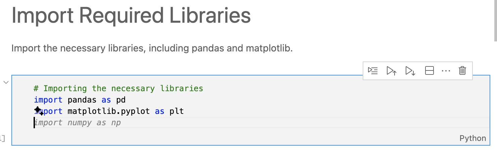

- **Interactive User Chat**. Open a chat window (sidebar) or dialog (inline) to start an interactive question-answer session. You can accept/discard responses (inline) or copy/paste them from window. For example - I can now ask for more details about the suggested import in a chat window. Note how it uses the file as a context reference.
    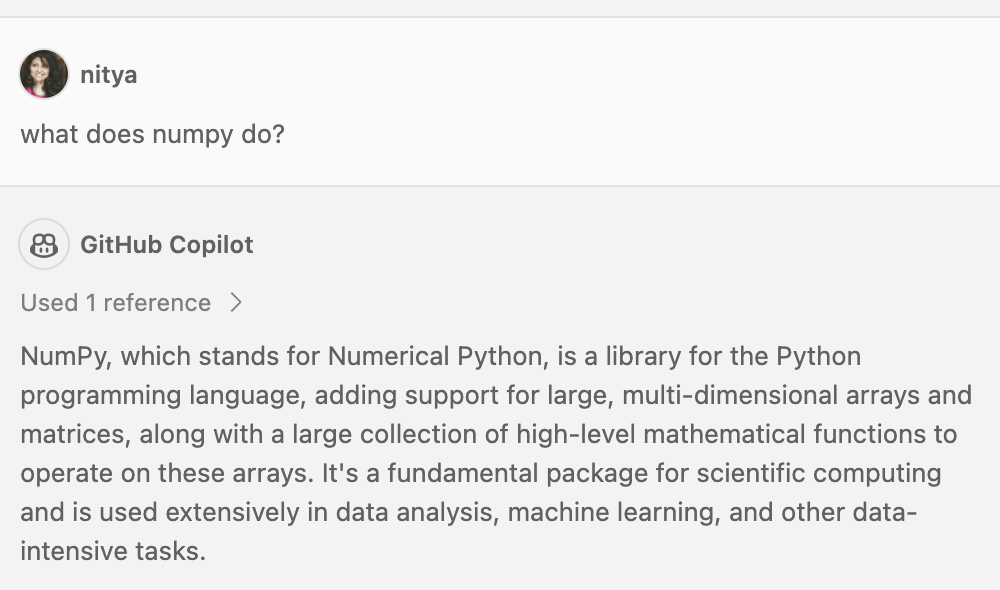

Think of GitHub Copilot as an _assistive_ technology rather than an _automation_ tool in your workflow. Since the technology uses an LLM, it may have inaccurate or outdated information - so make sure you validate responses before you accept them. Using this technology requires [an active subscription](https://docs.github.com/en/billing/managing-billing-for-github-copilot/about-billing-for-github-copilot) but there is a [30-day free trial](https://github.com/settings/copilot) to help you evaluate the capability for your own needs. The  [Data Science Profile Template](https://code.visualstudio.com/docs/editor/profiles#_data-science-profile-template) for Visual Studio Code adds this extension to your profile by default if used.
 

## 2 | What can GitHub Copilot do?

As we saw earlier, the AI can provide proactive suggestions (auto-completion) or reactive responses (user chat) using your current context (file or workspace) to ensure that responses are relevant to current tasks. In addition to these capabilities, the GitHub Copilot extension comes with built-in _slash commands_ that are optimized for common tasks. Simply open the inline chat dialog (editor) or the dedicated chat window (side) and type `/` to see the available commands as shown:

| Chat Commands | Inline Commands|
|:---|:---|
| 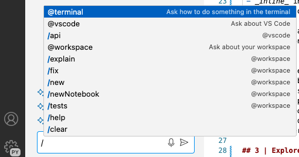 | 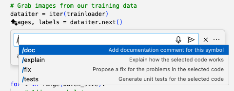 |

The table below provides a short summary of what the commands do. Note that commands that can impact the currently-open file (e.g., add or modify code) can be used in both inline (dialog) and chat (window) modes. Other commands that are more general work only in the chat (window) pane.

| Command  | Description | Usage |
|:---|:---|:---|
| /doc | Add comments for code using right syntax | Inline and Chat |
| /explain | Get code explanations in natural language  | Inline and Chat |
| /fix | Fix problems in the specified code | Inline and Chat|
| /tests | Create unit tests for the selected code | Inline and Chat |
| /newNotebook |  | Chat only | 
| | |

## 3 | GitHub Copilot For Data Science

So how can you use GitHub Copilot to enhance your Python Data Analysis and Visualization **learning journey**? Let's check out some simple examples:

### 3.1 Use `/doc` to add comments

In this exercise, open the `3-copilot/02-cricketNotebook.ipynb` notebook in your Visual Studio Code editor and let's explore using the `/doc` command to add comments to the first code cell. Not only does this encourage good documentation practices, it also helps you gain insight into what the code does if you are not the author (e.g., was auto-generated or written by someone else)

| Inline Example | Chat Example |
|:---|:---|
|  | 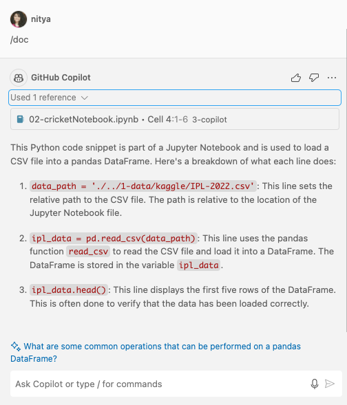 |
| | |

Note how the inline version provides a response that is formatted for inclusion into the code cell (with Accept/Discard) options) while the chat version provides more of an explanation of that code that could be used in a relevant user guide or tutorial. **Hint:** Try using the `/explain` command in chat mode instead to see how it compares to the response above.

Another useful feature in chat mode is the *follow-up question* suggested (at the bottom, in blue). These suggested prompts are a great way to **build our intuition** by following suggested questions based on the previous query, but still relevant to the context of our current task. Contrast this with "googling" for answers or "searching Stack Overflow" where you need to context-switch (to use a new site) and may end up in rabbit holes that keep you distracted and away from your original task.

### 3.2 Use `/tests` to write a unit test for the selected code

1. Let's try this out to see what happens. Select the same code cell above, then try using the `/tests` command inline. 

    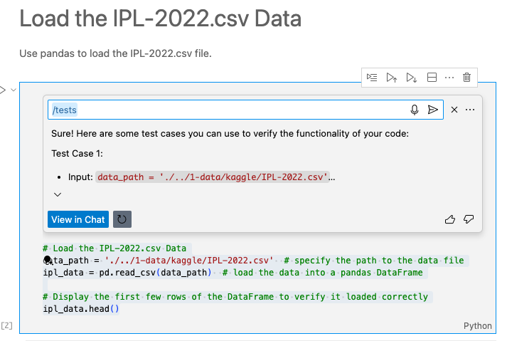

1. It gives you the option to "View In Chat" so let's take that route to see what tests are suggested. We see two basic tests (check for existence of valid and non-existent files) plus some suggestions (check for empty files or poorly-formatted ones).

    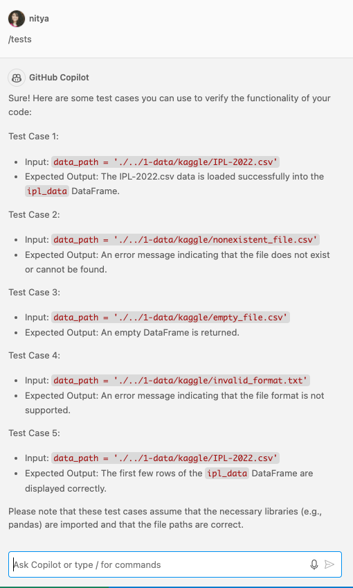

1. You will get a prompt to "Create" tests which will try to create a new tests notebook, with some issues. Instead, try copying the test code over into a new Python cell and run it, to verify it works. 

There are more complex tests to write - but this showcases the streamlined developer experience for common tasks in VS Code.

### 3.3 Use `/newNotebook` to create notebooks

You can create a new Jupyter notebook _with pre-written code and documentation_ for a stated goal. Let's try this out by asking GitHub Copilot to get us started with a notebook for visualizing the cricket data in the file we looked at before. This will create it as an untitled notebook with the outline specified in that response.

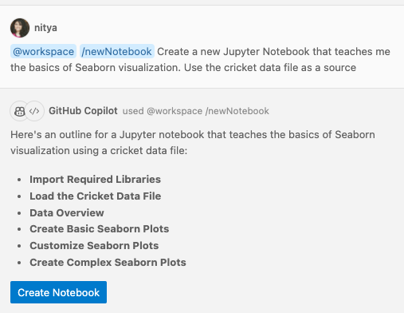

Save that to a file like `01-newNotebook.ipynb` and try running it with no modifications. Note how there are errors because of the filename mismatch. (Note: I deleted sections of the saved file for simplicity - so the outline is truncated).

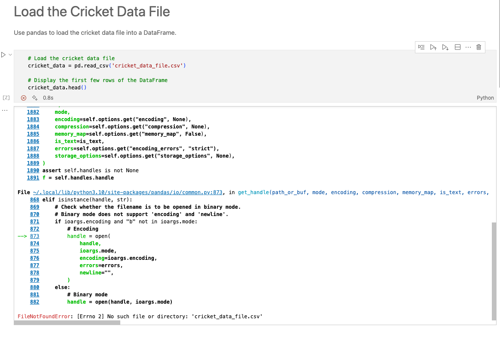

We can stay in the flow by asking the AI to fix the issue itself.

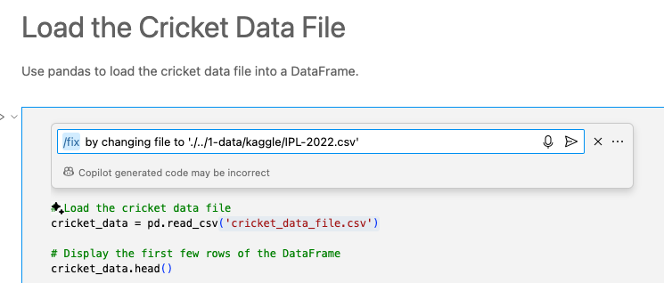

Then run it to see the fix resolved, and output generated as required.

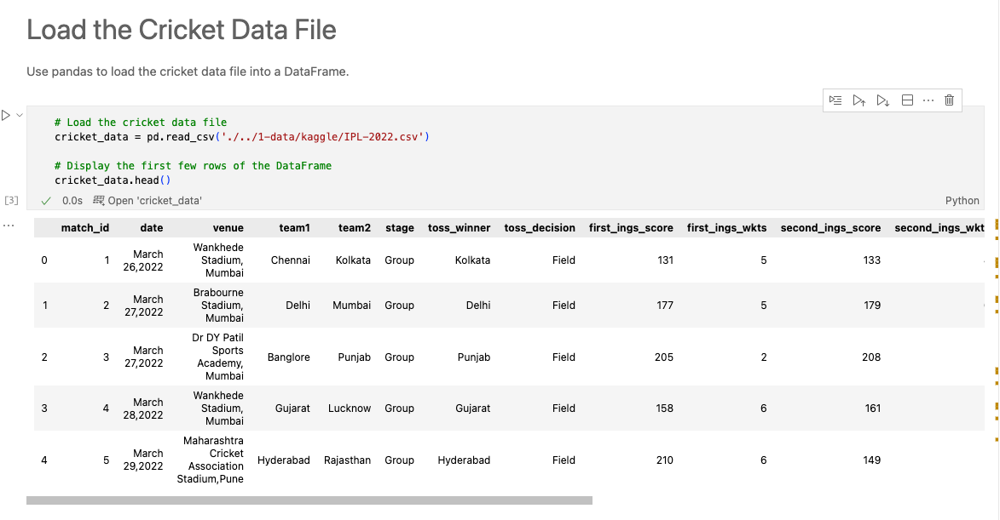

You can now try asking the AI to write new code or content sections for you to explore specific visualizations or seaborn syntax and capabilities. Check out the `01-seaborn-datawrangler-ipl.ipynb` file as an example of what is possible.

## 3 | Exercise: Try it yourself!

In the above exercises, we created a notebook using a sample data file, and walked through steps to get us to a basic data analysis and visualization result. Try replicating this with a dataset of your own (e.g., try the TED Talks dataset found under the `1-data/kaggle/` folder).

---

## Read the Post

[Check out Day 3 of #14DaysOfDataScience](https://30daysof.github.io/data-science-day/week-2/3-github-copilot/) for a post on this topic. Then revisit this page regularly for updates on exercises.

